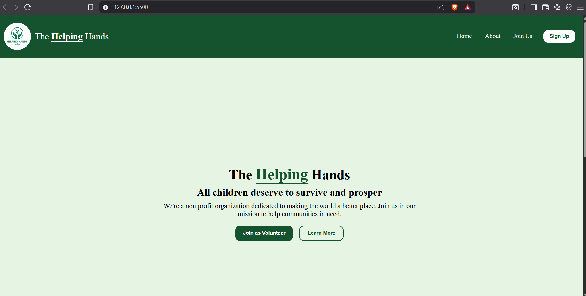
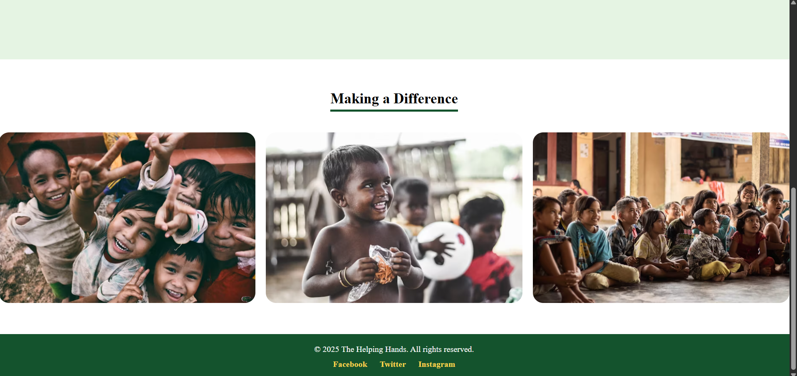
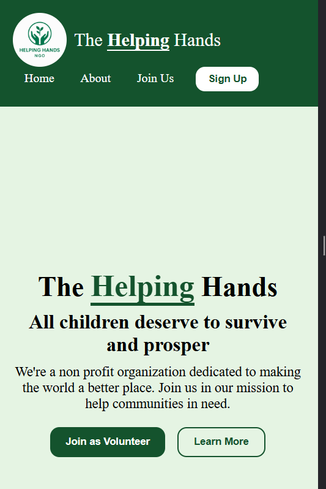
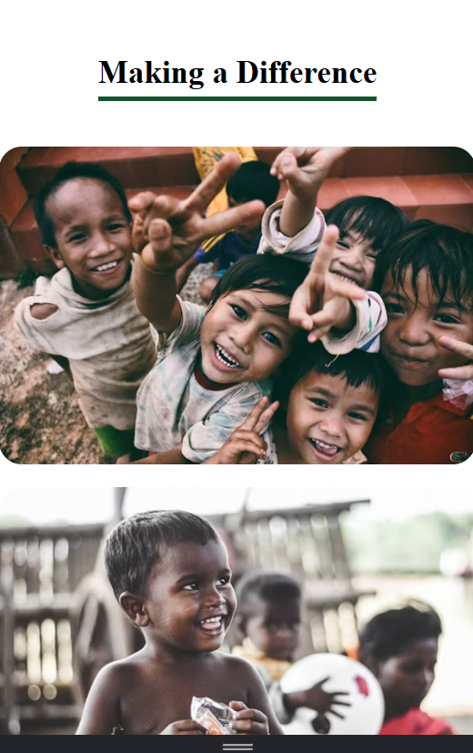

# The Helping Hands Landing Page

## Project Overview
This is a **responsive landing page** created for a non-profit organization called **The Helping Hands**.  
The goal of this project is to build a clean, user-friendly, and mobile-friendly webpage using **HTML** and **CSS** that showcases the organization's mission and encourages visitors to join or learn more.

---

## Features
- **Responsive Navbar:** A header with a logo and navigation links that adapts to different screen sizes.
- **Hero Section:** A full-screen welcoming section with a heading, description, and call-to-action buttons.
- **Image Gallery:** A section showing images related to the organization’s work.
- **Footer:** Contains social media links styled consistently with the theme.
- **Mobile Friendly:** Layout adjusts smoothly on phones, tablets, and desktops using CSS Flexbox and Grid.
- **Clean Design:** Simple and modern color scheme with easy navigation.

---

## Project Structure
LandingPage/
│
├── index.html # Main HTML file
├── style.css # CSS stylesheet
└── assets/ # Folder containing images and screenshots
├── logo.png
├── img1.png
├── img2.png
├── img3.png
├── desktop1.png,desktop2.png
└── mobile1.png,mobile2.png

---

## How to Run the Project Locally

1. Clone or download the repository.
2. Open the folder in your favorite code editor (like VS Code).
3. Open the `index.html` file in your browser:
   - You can double-click the file, OR
   - Use **Live Server** extension in VS Code for a live preview with auto-reload.
4. Resize the browser or use developer tools to test responsiveness on different devices.

---

## Screenshots

### Desktop View

### Mobile View

---

## Technologies Used

- HTML5
- CSS3 (Flexbox, Grid, Media Queries)

---

## What I Learned

- How to structure semantic HTML for better accessibility and SEO.
- Using Flexbox and CSS Grid to create flexible, responsive layouts.
- Writing media queries to adapt design on various screen sizes.
- Organizing project files and assets clearly.
- Using VS Code Live Server to speed up development.
- Basics of version control with Git and GitHub (init, add, commit, push).
- Creating a well-documented README file.

---

## Future Improvements

- Add animations and transitions for smoother user experience.
- Include a contact form for visitors to get in touch.
- Integrate with a backend or CMS to manage content dynamically.
- Add icons to social links for better visual appeal.

---

## How to Contribute

Feel free to fork the project, make improvements, and submit pull requests. For any questions or feedback, you can reach me at sakshianuprekshanegi@gmail.com

---

## License

This project is open source and available under the [MIT License](https://opensource.org/licenses/MIT).

---

Thank you for visiting **The Helping Hands** landing page project!
